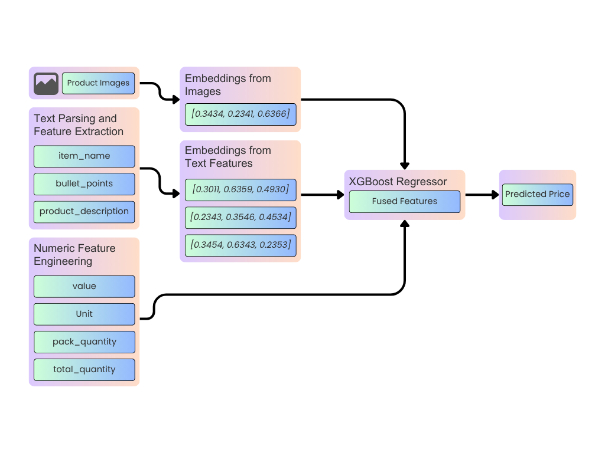

# Problem Overview - Amazon ML Challenge 2025

In e-commerce, determining the right price for a product is essential for both competitiveness and customer satisfaction.
Given product image and textual product details such as item name, description, value and unit, the challenge is to build a regression model that learns the mapping between product features and their actual market prices.

# Dataset Description

- Training Set: 75 000 products with complete product details and prices.
- Test Set: 75 000 products for final evaluation.
- Evaluation Metric: SMAPE (Symmetric Mean Absolute Percentage Error).

| Column          | Description                                                                           |
| --------------- | ------------------------------------------------------------------------------------- |
| sample_id       | Unique identifier for each sample                                                     |
| catalog_content | Concatenated text including product title, bullet points, description, value and unit |
| image_link      | URL to access images                                                                  |
| price           | Price of the product or target variable                                               |

# Solution Approach

1. Features such as `item_name`, `bullet_points` and `product_description` were extracted from the `catalog_content` column.

2. Using marqo-ecommerce-embeddings-L embedding model, 1024 dimension embedding vectors were generated from product images and the weighted extracted text features. 

3. Extracted the numeric `Value` (e.g., “Value: 72.0”) and measurement unit following the keyword `Unit` (e.g., Ounce, Count, Fl Oz) using regular expressions. Computed multiple numerical transformations such as `log_value`, and `sqrt_value` to capture non-linear effects.

4. Detected pack-quantity such as “Pack of 6”, “6-pack”, “12 count” and expanded on feature set with `pack_quantity`, `log_pack`, `total_quantity` = `value` × `pack_quantity` and its log and sqrt variants.

5. Combined multimodal semantic embeddings with structured numeric attributes to create a single, rich feature representation for model training.

6. Trained an XGBoost with 5-fold cross-validation and early-stopping with GPU acceleration.

7. Produced Out-of-fold (OOF) predictions for unbiased validation and per-fold SMAPE scores for evaluating model stability across folds.

# Training Results
Fold SMAPE scores: ['49.2047%', '48.0522%', '48.4541%', '47.4840%', '48.2107%']\
Fold std: 0.5614%\
Mean fold: 48.2811%